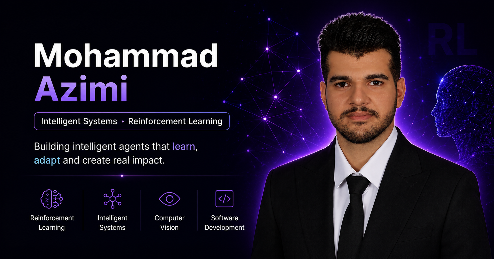

<div align="center">

# Mohammad Azimi — Personal Portfolio

### Intelligent Systems · Reinforcement Learning · Software Development

A cinematic personal portfolio presenting my academic journey, technical skills, research background, professional experience and projects as I continue building my path in Intelligent Systems and Artificial Intelligence.

[Live Website](https://mohammad-azimi.github.io/) · [LinkedIn](https://www.linkedin.com/in/-mohammad--azimi-/) · [GitHub Profile](https://github.com/mohammad-azimi)

</div>

<br />



## About the Portfolio

This portfolio was redesigned as a modern, animated web experience centered on my academic and professional direction in **Intelligent Systems**, with a primary interest in **Reinforcement Learning** and an additional interest in **Computer Vision**.

I am a Computer Engineering graduate enrolled in the Master's program in Intelligent Systems at Peter the Great St. Petersburg Polytechnic University.

## Featured Sections

* **Cinematic Hero** — an interactive Reinforcement Learning-inspired visual scene built around Agent, Action and Reward.
* **About Me** — personal introduction and current AI direction.
* **Skills & Languages** — development tools, AI interests and language abilities.
* **Education** — academic timeline, including my Russian Language and Pre-University Preparatory Course and Master's enrollment.
* **Experience** — university employment, technical internship and independent AI learning.
* **Achievements** — certifications and academic accomplishments.
* **Research & Publications** — published conference research in Artificial Intelligence and Computer Vision.
* **Projects** — product-focused showcase of my Habit Tracker application.
* **Contact** — direct contact form integrated with Formspree.

## Featured Project

### Habit Tracker

A modern habit tracking web application designed to support consistent routines through daily check-ins, progress analytics and push notification reminders.

**Key features:**

* Daily habit tracking and completion logs
* Progress monitoring dashboard
* Scheduled push reminders
* Progressive Web App experience
* Responsive user interface

**Technologies:** React, Vite, Tailwind CSS, PWA, Push Notifications

[Live Demo](https://mohammad-azimi.github.io/Habit-Tracker/) · [Source Code](https://github.com/mohammad-azimi/Habit-Tracker)

## Research & Publication

### Early Detection of Forest Fires Using Unmanned Aerial Vehicles and Artificial Intelligence

Published conference paper exploring the use of unmanned aerial vehicles, artificial intelligence and computer vision for early smoke and forest-fire detection.

**Topics:** Artificial Intelligence, Computer Vision, UAV, Forest Fire Detection, Crisis Management

[View Publication](https://en.civilica.com/doc/1650184/)

## Built With

* **React** — component-based user interface
* **Vite** — development and production build tooling
* **Tailwind CSS** — responsive visual styling
* **GSAP + ScrollTrigger** — cinematic scroll-driven animations
* **Formspree** — functional contact form submission
* **React Icons / Lucide React** — interface and brand icons
* **GitHub Actions** — automated GitHub Pages deployment

## Running Locally

```bash
git clone https://github.com/mohammad-azimi/mohammad-azimi.github.io.git
cd mohammad-azimi.github.io
npm install
npm run dev
```

Open the local development URL shown in the terminal.

## Production Build

```bash
npm run build
npm run preview
```

## Deployment

The portfolio is deployed on **GitHub Pages** through a GitHub Actions workflow. Every deployment from the `main` branch builds the Vite application and publishes the generated production files.

## Contact

* **Portfolio:** [mohammad-azimi.github.io](https://mohammad-azimi.github.io/)
* **GitHub:** [@mohammad-azimi](https://github.com/mohammad-azimi)
* **LinkedIn:** [Mohammad Azimi](https://www.linkedin.com/in/-mohammad--azimi-/)

---

<div align="center">

Designed and developed by **Mohammad Azimi**

</div>
